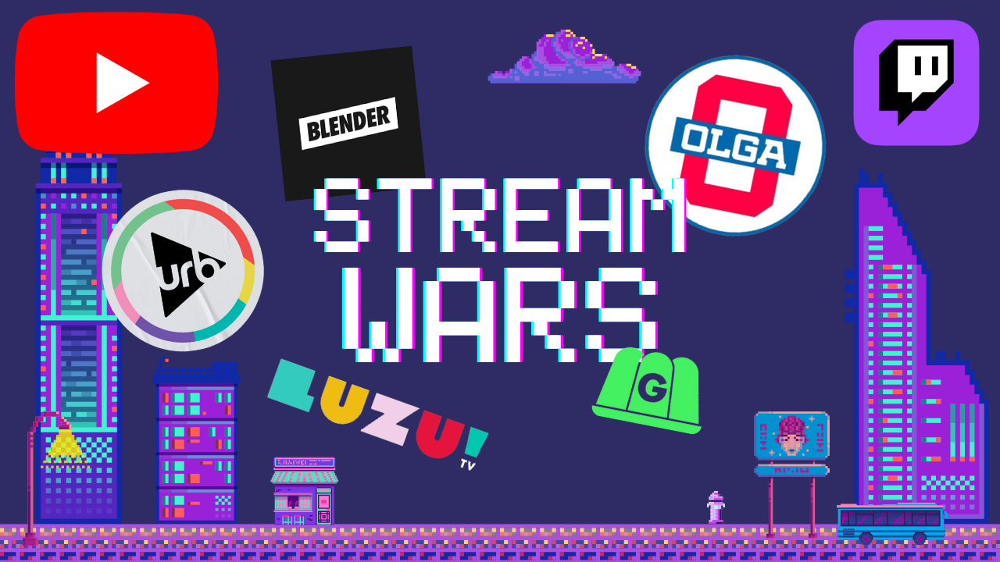

## Ejercicio realizado en clase

Bienvenid@ al mundo de los **streams**, todos los días la gente pasa miles de horas consumiendo este contenido que en los últimos años ha explotado en su variedad. A nuestro cliente lo carcome la curiosidad sobre cual stream la esta rompiendo y para ello nos pide que desarrollemos el siguiente sistema

## Punto 1

Lo primero que nos pide es saber la cantidad de viewers (personas sintonizando) de un stream. No todos los streams calculan sus viewers de la misma manera, nuestro cliente nos cuenta de los siguientes ejemplos

* Episodio Soñé Que Volaba (SQV)  
  * Tiene 10000 viewers por cada canción que suene en el episodio  
* Episodio Hay Algo Ahi (HAA)  
  * Si Rebord (el conductor) puede hacer análisis sesudos hay 20000 viewers  
  * Si no, hay 10000  
  * Rebord puede hacer análisis sesudos cuando la realidad esta interesante (están ocurriendo más de 10 sucesos)  
* Sesion de streamer independiente  
  * Son la cantidad de suscriptores al momento de la transmisión multiplicados por un factor aleatorio (1 a 3\)  
  * Los streamers independientes pueden tener un frenesí de suscripciones, donde se duplican sus suscriptores

## Punto 2

Los streams suelen tener invitados, de los cuales nos interesa su popularidad. La cual se calcula como la mitad de sus seguidores en instagram.

Hay algunos invitados que son influencers junto con sus mascotas, si juega con ellas sus seguidores de instagram se multiplican por la cantidad de mascotas.

## Punto 3

Ahora queremos saber cuales de estos streams la están pegando, que ocurre cuando su nivel de hype es mayor a 60

Los streams pueden tener invitados, y su nivel de hype se calcula como la sumatoria de la popularidad de todos sus invitados, como máximo 100\.

 Excepto por HAA que su hype es siempre 100

## Punto 4

Nos comentan también de un streamer que la esta rompiendo, Coscu, además de tener viewers por sus suscriptores lo mira toda la gente que esté conectada, esto depende del momento del dia

* Mañana: 1000 personas  
* Tarde: 5000 personas  
* Noche: 10000 personas

## Punto 5

Ahora queremos saber cuales son las ganancias de estos streams, sabemos que lo que gana un stream es igual a la cantidad de viewers por el nivel de hype, pero sobre esto hay recortes

* Los episodios de los canales tienen un costo de producción que se le resta a las ganancias  
* En cambio los streamers independientes (como Coscu) se quedan con toda la ganancia menos el 10%, que es para la plataforma
